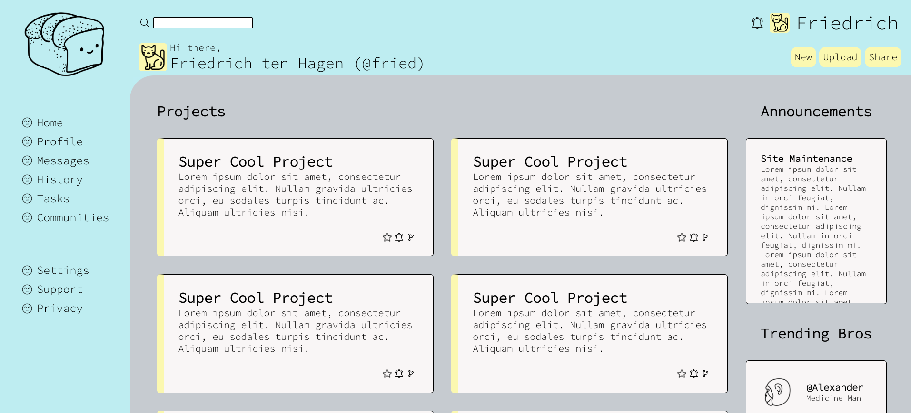
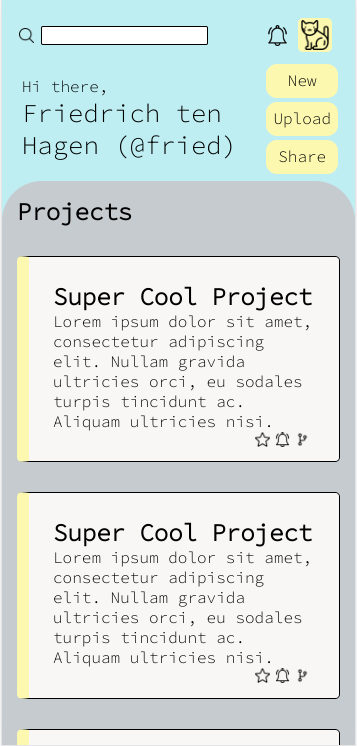

# Admin Dashboard

The dashboard of an imaginary online service. This project is strictly HTML and CSS. 

Here is a link to the live demo: https://friedrichtenhagen.github.io/admin-dashboard/

desktop screenshot: 

mobile screenshot: 

## How it's made: 

### Tech used: HTML, CSS

This was an exercise to focus on my CSS skills and use grid layout in conjunction with flexbox. 

## Lessons learned: 

I was able use emmet to quickly write large amounts of html. I also used grid and flexbox together. I created breakpoints for the mobile view with @media rule. 